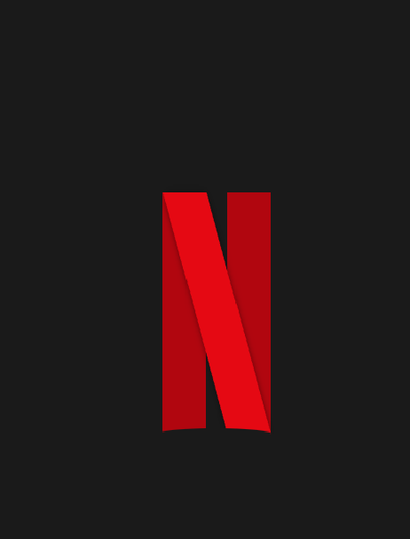

<h1 align="center">
  Logo Netflix
</h1>

  <a href="#-tecnologias">Tecnologias</a>&nbsp;&nbsp;&nbsp;|&nbsp;&nbsp;&nbsp;
  <a href="#-projeto">Projeto</a>&nbsp;&nbsp;&nbsp;|&nbsp;&nbsp;&nbsp;
  <a href="#memo-licença">Licença</a>

 

<h1>Resultado</h1>

  

---

## 🚀 Tecnologias

Essa ilustração foi desenvolvida com as seguintes tecnologias:

- HTML
- CSS

## 🚧 Projeto

Neste desafio foi recriado o logo da Netflix.

## :memo: Licença

Esse projeto está sob a licença MIT. Veja o arquivo [LICENSE](.github/LICENSE)

---

